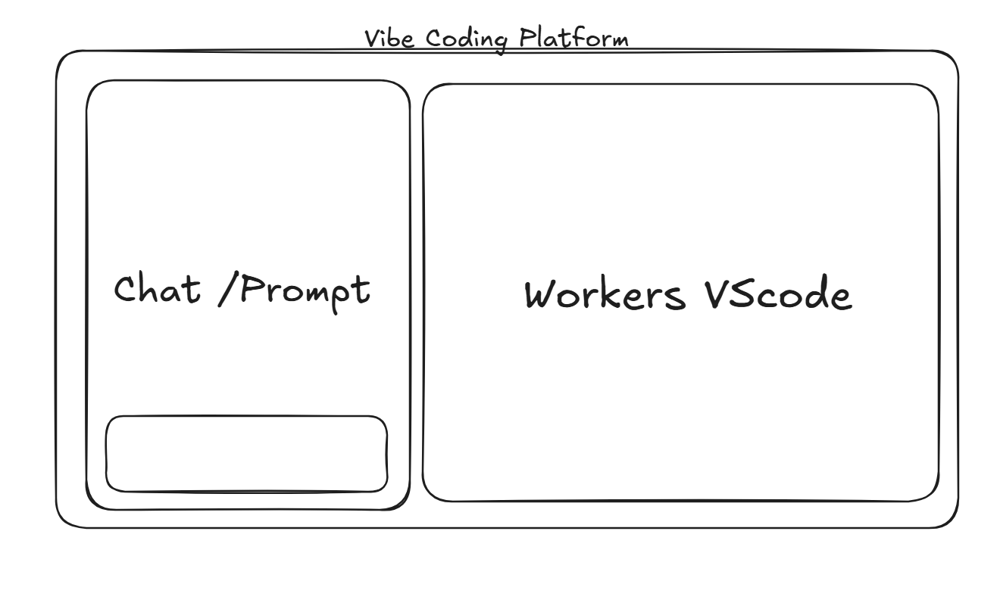
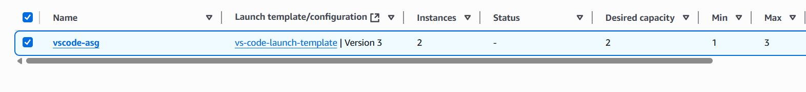
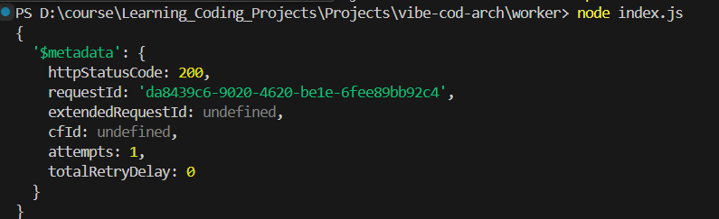
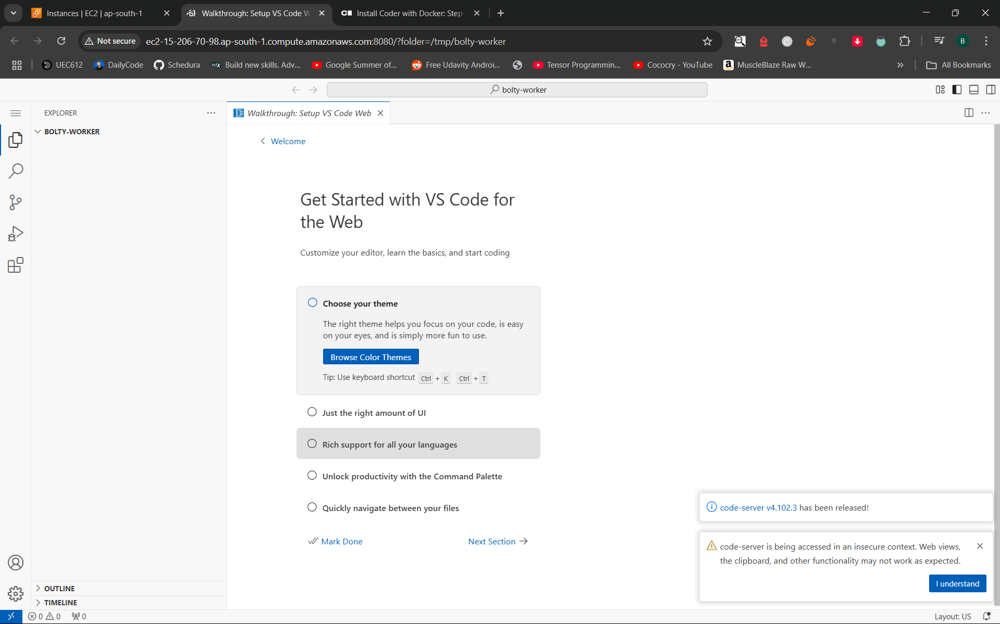

## Vibe Coding Platform — ASG Worker

This repository contains a minimal worker that programmatically scales an AWS Auto Scaling Group (ASG) used to host web VS Code (code-server) worker instances for the Vibe Coding Platform.

### At a glance
- **What it does**: Sets the desired capacity of an ASG using AWS SDK v3
- **ASG name**: `vscode-asg`
- **Region**: `ap-south-1`
- **Current behavior**: Sets desired capacity to `2` and honors cooldowns

### Architecture sketch


### Screenshots
- ASG dashboard

  

- Successful AWS API call (200 OK)

  
  

- VS Code Web running on a worker

  

### How it works
- `worker/index.ts` loads AWS credentials from environment variables via `dotenv`
- Creates an `AutoScalingClient`
- Sends `SetDesiredCapacityCommand` to set the ASG to a specific desired size

### Prerequisites
- Node.js 18+ (required by AWS SDK v3)
- An AWS account with permissions to modify the target ASG
  - Minimum IAM permissions: `autoscaling:SetDesiredCapacity`, `autoscaling:DescribeAutoScalingGroups` (scoped to your ASG if possible)

### Setup
1) Create your environment file

   - Copy `worker/.env.example` to `worker/.env` and set:
     - `AWS_ACCESS_KEY`
     - `AWS_ACCESS_SECRET`
   - Recommended: Prefer using an IAM role (instance profile/task role) over static keys.

2) Install dependencies

```bash
cd worker
npm install
```

### Run
- Using the compiled JavaScript (already present):

```bash
cd worker
node index.js
```

- Or compile TypeScript then run:

```bash
cd worker
npx tsc
node index.js
```

Expected output is an AWS SDK response object with `httpStatusCode: 200`. The ASG console should show `Desired capacity: 2`.

### Configuration
These values are currently hardcoded in `worker/index.ts`:
- `region`: `ap-south-1`
- `AutoScalingGroupName`: `vscode-asg`
- `DesiredCapacity`: `2`

To change the target or size, edit the corresponding fields in `worker/index.ts`.

### Security notes
- Never commit real credentials. `.gitignore` excludes `.env`, but ensure your keys are not leaked elsewhere.
- If credentials are ever exposed, rotate them immediately and prefer IAM roles with least privilege.

### Repository structure
- `worker/` — the scaling worker
  - `index.ts` / `index.js` — main script
  - `.env.example` — environment template
  - `.gitignore` — ignores `.env` and `node_modules`
  - `package.json` — dependencies (AWS SDK v3, dotenv)
  - `tsconfig.json` — TypeScript configuration
- Images at repo root used in this README: `code.png`, `asg.png`, `image.png`, `vscode.png`

### Notes and next steps
- Integrate this worker into your platform to scale on demand based on user sessions or queue depth
- Consider target tracking or step scaling policies driven by CloudWatch metrics for automatic elasticity
